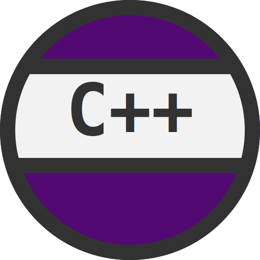

<div align="center">
   <h1 align="center">csvg: A Simple SVG Library in C</h1>
</div>
<br />

`csvg` is a minimalistic library for creating Scalable Vector Graphics (SVG) files using the C programming language. This library adheres to the [W3C SVG](https://www.w3.org/TR/SVG2/) standard and is designed to simplify various graphic tasks.

### Getting Started

For more info see [getting started](examples/README.md).

### Example

``` c
#include "csvg.h"

int main()
{
   int x, y, x1, y1, x2, y2;
   double a;
   int i, r = 200;

   SVG *svg = svg_init( "example_01.svg", 830, 450 );

   svg_set_background( svg, 0x530972 );

   x = 415;
   y = 225;

   a = 2 * M_PI / 6;

   svg_hexagon( svg, x, y, r + 10, 6, 0, 0xFAF2FE );
   svg_filled_hexagon( svg, x, y, r, 0, 0x5C6BBF );

   for( i = 0; i < 2; i++ )
   {
      x1 = x + r * cos( a * i + M_PI / 6 );
      y1 = y + r * sin( a * i + M_PI / 6 );
      x2 = x + r * cos( a * ( i + 1 ) + M_PI / 6 );
      y2 = y + r * sin( a * ( i + 1 ) + M_PI / 6 );
      svg_filled_triangle( svg, x, y, x1, y1, x2, y2, 0x283492 );
   }

   svg_circle( svg, x, y, 100, 66, 0xFFFFFF );

   x1 = x + r * cos( a * 5 + M_PI / 6 );
   y1 = y + r * sin( a * 5 + M_PI / 6 );
   x2 = x + r * cos( a * ( 5 + 1 ) + M_PI / 6 );
   y2 = y + r * sin( a * ( 5 + 1 ) + M_PI / 6 );
   svg_filled_triangle( svg, x, y, x1, y1, x2, y2, 0x3848AA );

   svg_close( svg );
   return 0;
}
```


```c
#include "csvg.h"

int main()
{
   int width = 512, height = 512;

   SVG *svg = svg_init( "logo_template.svg", width, height );

   svg_filled_circle( svg, width / 2, height / 2, 256, 0x530972 );

   svg_line( svg, 42, ( height - 250 ) / 2, width - 42, ( height - 250 ) / 2, 30, 0x323232 );

   svg_filled_rect( svg, 25, ( height - 220 ) / 2, width - 50, 180, 0xF2F2F2 );

   svg_line( svg, 25, ( height + 141 ) / 2, width - 25, ( height + 141 ) / 2, 30, 0x323232 );

   svg_circle( svg, width / 2, height / 2, 256 - 15, 30, 0x323232 );

   svg_text( svg, ( width - 3 * ( 140 * 0.6 ) ) / 2, ( height + 20 ) / 2, "C++", "Free Mono", 140, FONT_WEIGHT_BLACK, 0x323232 );

   svg_close( svg );

   return 0;
}
```

<div style="text-align: center;">
    
</div>

### Contributing
Contributions are welcome! Feel free to submit a pull request.
